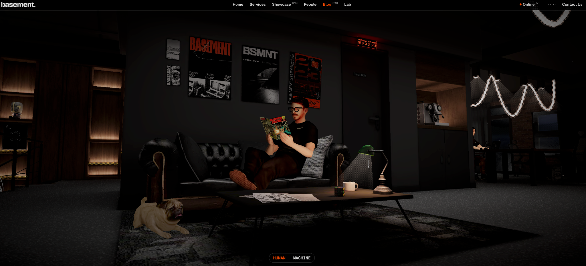

# 首屏定稿方向：Basement 参考 × 赵越三维工作室
版本：v1.1 · 2026-09-25。与 MASTER_BRIEF.md 同步，细化首屏执行，不改变保护经典版的边界。

## 1. 最新用户决定

首屏参考 https://basement.studio/blog 与本包附图；整体是略带赛博朋克风格的工作台/工作室，赵越本人坐在桌前，首屏核心环境要有真实三维效果；交互版/经典版组件借鉴图中底部居中胶囊。

这五项是确定需求，不是待选创意。具体灯光、机位、风格化程度和本人造型仍需视觉批准。

## 2. 直接参考图

来源：用户本轮上传 `Screenshot 2026-09-25 at 16.22.11.png`，2048×931。图内人物未被识别，也不是赵越肖像。原图仅作私有设计参考，版权归原权利人；不复制进生产页面、OG 图、宣传素材或人物纹理。

当前可从截图确认：完整室内环境与人物、前中后景、暖色局部灯光、顶部常规导航、底部 HUMAN/MACHINE 胶囊。不能仅凭截图确认加载、Hover、可点击范围、切换动画或当前性能。Codex 应在可用浏览器实查要借鉴的动作。

## 3. 从参考到本站：保留机制，更换身份与内容

| 参考中可见的组织方式 | 本站的设计处理 |
|---|---|
| 人物在自己的环境中生活 | 赵越坐在自己的创作工作台前，不是照搬沙发读书姿势 |
| 家具、墙面与灯具组成房间 | 桌椅、显示器、书架、照片和灯具共同构成一个主景 |
| 个人物件自然分布 | 真实书、音乐、摄影、Finfold 和影像作品各有可理解入口 |
| 顶部导航不抢画面 | 姓名/角色与项目、简历、联系、语言直接可用 |
| 底部双段胶囊 | 交互版 / 经典版；英文 EXPLORE / CLASSIC |
| 暗色室内与重点照明 | 保留空间气氛，但提亮人物、桌面与首个入口，避免看不清 |

不要复制对方人物、脸、狗、海报、办公室布局、字标或资产。墙上的材料应用赵越自己的摄影、CALL ME YAO 海报或真实项目，不伪造生活细节。

## 4. 默认场景构图

工作室像访客能走近的真实创作空间，不是漂浮的游戏道具集合。

推荐三分之四侧面机位：人物和桌面一同成为主视觉，能看到人物侧脸，也能辨认主显示器。先用体块验证视线与遮挡关系，再制作细节。不要为了同时露出脸与屏幕，把人和家具摆得不符合实际。

前景：少量桌沿、相机或唱片，形成进入场景的层次，但不遮挡底部模式胶囊。
中景：赵越坐姿角色、椅子、桌面、主屏幕、唱片机，是画面与交互中心。
背景：书架、照片/海报、墙面/窗边灯光，补充生活与创作气质，不要求全部可进入。

首屏不放长文、不把巨大姓名压在人物脸上，不塞满六个产品屏幕。不做完整公寓、城市天际线或多层房间系统。主场景外的世界先通过内容面板与局部机位承接。

## 5. 本人三维角色

### 5.1 素材与批准

当前交接包没有可用于塑造赵越的本人照片。先检查仓库里经用户确认、适合公开的肖像；不自动拿证件照/护照页、旧申请材料、参考截图中的人或其他私人图像当建模依据。

制作前请用户确认一张清晰正面、一张左右任一侧面或四分之三侧面、以及一张能看出发型/日常穿着或坐姿的照片；已有一张清晰照片时可先做简化版本，缺失外形如实标记，不阻塞房间制作。不得为了凑角度自动编造并声称准确。

没有照片：房间、家具、相机、UI、性能原型照常推进；人物使用中性坐姿体块并标注“待本人参考”。该体块不得作为最终头像、本人作品展示或宣传封面。

### 5.2 美术与动作建议

优先做有本人辨识度的风格化三维角色，与房间材质保持一致。不是默认玩具小人，也不要求达到影视级皮肤与头发。脸、发型、身形、穿着和姿态经用户确认后锁定。

人物开场已经坐好。用呼吸、手部短操作或细微肩部动作体现活人感；动作幅度服从镜头和交互，不每几秒招手、不持续追踪访客、不强制说欢迎词。不在本期制作行走、换装、复杂表情或对话代理。

角色、座椅、桌面接触可信：脚不悬空、手不穿键盘、身体不穿椅背。小角色远景也要在近景检查外貌和接触，再回首屏判断是否清楚。

角色应独立于静态房间，有可编辑网格、材质、必要骨架和动作说明。普通坐姿就能满足首期，不因追求全身动画而停工，也不因此取消角色。

## 6. 赛博朋克的程度

用户要的是略带赛博朋克的高完成度创作空间，建议采用深色环境、局部屏幕冷光、暖色灯/红橙标识，以及精细金属、织物与纸张。

重点光源指向人物与工作台；暗处仍有轮廓。禁止把全场调黑后用 bloom 充当材质，不把每个物体都染成荧光蓝紫，不把有效内容埋在闪烁噪声里。

Basement 官方制作文章采用过 PS2 方向；我们借鉴它的空间叙事与制作思路，是否保留颗粒/抖色或改得更细腻由目标图确认。不要默认“参考 Basement”就必须复制低分辨率和复古滤镜。

## 7. 全三维要求的边界

正常模式必需：人物、桌椅、显示器、唱片机、书与主要空间结构在真实三维场景内，支持实际的遮挡、透视和交互机位。
允许的二维内容：屏幕上的真实产品图、书封、海报和照片可以作为三维物件表面的素材；正文、导航、胶囊和播放控制使用 HTML/DOM。
不允许冒充完成：整张生成房间图加鼠标视差、循环视频加热点、照片人物剪影贴片、离线渲染配不可用入口。
加载/降级例外：可显示与已制作场景一致的轻量首帧，同时保留常规入口，清楚记录它不是完整三维就绪。用户关闭重动效时仍提供内容。

## 8. 底部交互版 / 经典版胶囊

外观参考截图的低调深色细边框双段胶囊，固定在视口底部中间，不挂在房间世界坐标里。
中文固定命名：交互版 / 经典版。英文：EXPLORE / CLASSIC。当前段以状态底色、边框/标记和可访问状态共同区分，不仅改变字色。
位置：桌面居中、靠下但不贴边；移动端加底部安全区，建议控件点击高度约 44–48px（本项目设计建议，不是对参考实测尺寸）。面板、字幕、播放器和经典版正文必须预留底部空间。
两版共享一个控件，加载、故障、滚动、打开详情时仍能找到。不要在顶部再造一套不同状态的切换控件。
行为：单击直接选择对应模式，记住明确偏好；具体路径优先，分享链接不被上次偏好劫持；状态同步真实路由。
过渡：轻微淡入淡出或选中底片移动即可，不播放长房间退出动画，不让人物走路成为导航前置条件。切出三维后停掉不必要渲染和声音，回来恢复合理视角。
可用性：正常链接/按钮语义、键盘可达、焦点可见、触屏直接点。模型加载失败时控件必须独立运行。

原站另有 Machine view，并明确为机器可读文本镜像；我们仅借其 UI 形态，不复制 HUMAN/MACHINE 语义，不自动增加第三个“机器版”。本轮未实际点击截图组件，对其动画不作断言。[R09c]

## 9. 第一次有效探索

0 秒的目标画面：赵越已经在桌前，主屏幕、唱片机、书可辨认，顶部入口和底部胶囊已可见。
用户稍作移动/触摸：只有当前关注物件给轻微反馈，不整屋物体一起弹跳。
第一次点击：唱片机动作并打开真实音乐内容，或者点击主屏进入 Finfold；无须先点人物说完欢迎词。
关闭内容：回原机位，主体和胶囊仍在同一视觉秩序。
切换经典版：一击到达现有清晰作品集；简历和项目旧链接不受影响。

人物可作为关于入口，但不成为所有物件的中介。首次样片先验证唱片机、Finfold、书和切换，其余入口后续展开。

## 10. Codex 制作步骤与停止条件

先阅读主文档并保护现站，再检查本图与可访问的原站。

P1 交付：桌面与手机同一主案的全景目标；人物坐姿/轮廓占位或已获本人参考的形象小样；屏幕与脸不互挡的机位说明；材质光线；底部胶囊两态；一次点击分镜。

有照片就进行本人角色设计审批，没有照片则明确人物待补，继续环境。不得因缺外貌资料把整站改为空桌。

P2 交付：真实三维房间、经确认的本人角色与必要待机、唱片完整小交互、Finfold/书入口、两版共用胶囊。素材不全时可交内部样片，但最终个人形象与综合首屏门槛不通过。

P3–P5 延续主文档，补内容、传播、测试和上线，不另开多房间或飞船项目。

真实网页要单独验收：概念图、Blender 渲染、实际浏览器截图分别标注。光影、人物与空间在最终渲染器中一起看，不能三个各自好看就宣布完成。

## 11. 技术提示与性能预算

基于实际仓库选择三维接入，不迁移整站。建议一个主 Canvas 承载环境和人物，正常网页层承载导航与正文；不要不经测量照搬参考站的多 Canvas、专用 CMS 或人群实例化系统。

静态房间可评估烘焙光照与 AO，人物和可移动部件分别处理。压缩、解码、动画与角色资源均纳入首次下载和帧率实测；不能只报压缩后模型文件大小而漏掉纹理与解码资源。

v1.0 3–5MB 估算不是新增角色后的死限制；由 Codex 提出分项预算和实测依据，用户确认。质量/性能冲突先优化可见范围、贴图与静态光影，再提出选项，不静默删除角色或改成静态图。

## 12. 必须给用户看的证据

桌面首屏、手机首屏、人物近景、桌面/屏幕特写、模式胶囊两态、一次真实操作录屏、经典版往返、加载/故障后备各有证据。

至少一段传播素材让“赵越在三维工作室中”和一次物件探索都看得清；不把参考站画面或未实现的概念渲染剪成上线广告。

截图的视觉门槛和完整网站的功能门槛都要过。没有实际用户与渠道数据，就不写“已经高流量”“一定爆火”或“提高录取率已验证”。

## 13. 来源与核对范围

R09a 场景：https://basement.studio/blog ；直接视觉依据为用户本轮原图。已读取页面文本，没有实时浏览器点击验收。
R09b 官方制作记录：https://basement.studio/post/new-digital-hq-pt-1 ，Basement Team，2025-05-20。只用其短述的低多边形/压缩贴图、光照贴图、点选探索与人脸扫描方向作参考。历史实现不是当前库能力保证，也不授权复制资产。
R09c Machine view 定位：https://basement.studio/ai/home ，官网公开检索结果说明是 machine-readable index / plain-text mirror；不等于本站经典模式。

上述设计尺寸、镜头、人物动作和预算是本站实施建议，不是从截图测得的参考站参数。其余对标与技术资料见 REFERENCES.md。
